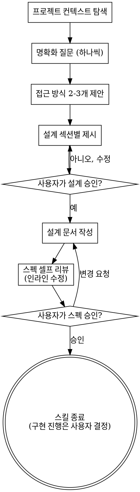

# 아이디어를 설계로 다듬는 브레인스토밍

자연스러운 협업 대화를 통해 아이디어를 완성된 설계와 스펙으로 다듬는다.

먼저 현재 프로젝트 컨텍스트를 파악하고, 질문을 한 번에 하나씩 던져 아이디어를 구체화한다. 무엇을 만들지 이해되면 설계를 제시하고 사용자 승인을 받는다.

<HARD-GATE>
설계를 제시하고 사용자가 승인하기 전에는 어떤 구현 행위도 금지한다 — 코드 작성, 프로젝트 스캐폴딩, 구현 스킬 호출 모두 해당된다. 아무리 단순해 보이는 프로젝트에도 예외 없이 적용된다.
</HARD-GATE>

## 안티패턴: "이건 너무 단순해서 설계가 필요 없어"

모든 프로젝트가 이 프로세스를 거친다. 투두 리스트, 함수 하나짜리 유틸리티, 설정 변경 — 전부 해당된다. "단순한" 프로젝트야말로 검증되지 않은 가정이 가장 큰 낭비를 만드는 곳이다. 설계는 짧아도 된다(정말 단순하면 몇 문장). 하지만 반드시 제시하고 승인을 받아야 한다.

## 체크리스트

아래 항목마다 태스크를 만들고 순서대로 완료해야 한다:

1. **프로젝트 컨텍스트 탐색** — 파일, 문서, 최근 커밋 확인
2. **명확화 질문** — 한 번에 하나씩, 목적·제약·성공 기준 파악
3. **접근 방식 2-3개 제안** — 트레이드오프와 추천안 포함
4. **설계 제시** — 복잡도에 맞게 섹션을 나눠 제시하고 섹션마다 사용자 확인
5. **설계 문서 작성** — `docs/specs/YYYY-MM-DD-<주제>-design.md`에 저장
6. **스펙 셀프 리뷰** — 플레이스홀더·모순·모호성·스코프 검사 후 인라인 수정
7. **사용자 스펙 리뷰** — 사용자가 스펙 파일을 검토·승인하면 스킬 종료

## 프로세스 플로우

**종착점은 스펙 승인이다.** 스펙이 승인되면 이 스킬의 역할은 끝난다. 구현을 진행할지, 언제 어떻게 진행할지는 사용자가 결정한다.

## 프로세스

**아이디어 이해:**

- 현재 프로젝트 상태(파일, 문서, 최근 커밋)를 먼저 파악한다
- 세부 질문 전에 스코프를 가늠한다: 요청이 여러 독립 서브시스템을 포함하면(예: "채팅, 파일 저장, 결제, 분석이 있는 플랫폼") 즉시 지적한다. 분해가 먼저인 프로젝트의 세부사항에 질문을 낭비하지 않는다
- 스펙 하나로 담기에 너무 크면 서브 프로젝트로 분해를 돕는다: 독립적인 조각은 무엇인지, 서로 어떤 관계인지, 어떤 순서로 만들지. 그 다음 첫 서브 프로젝트를 일반 설계 플로우로 브레인스토밍한다. 서브 프로젝트마다 각자의 스펙 사이클을 가진다
- 적절한 스코프의 프로젝트라면 질문을 한 번에 하나씩 던져 아이디어를 다듬는다
- 가능하면 객관식을 선호하되 주관식도 괜찮다
- 메시지당 질문은 하나 — 한 주제에 탐색이 더 필요하면 여러 질문으로 나눈다
- 목적, 제약, 성공 기준 이해에 집중한다

**접근 탐색:**

- 서로 다른 접근 2-3개를 트레이드오프와 함께 제안한다
- 추천안과 그 이유를 대화체로 제시한다
- 추천 옵션을 먼저 제시하고 이유를 설명한다

**설계 제시:**

- 무엇을 만들지 이해했다고 판단되면 설계를 제시한다
- 섹션별 복잡도에 맞게 분량을 조절한다: 단순하면 몇 문장, 미묘하면 200-300단어까지
- 섹션마다 여기까지 맞는지 확인을 받는다
- 아키텍처, 컴포넌트, 데이터 흐름, 에러 처리, 테스트를 다룬다
- 뭔가 앞뒤가 맞지 않으면 되돌아가 명확히 할 준비를 한다

**분리와 명확성을 위한 설계:**

- 시스템을 각자 하나의 명확한 목적을 갖고, 잘 정의된 인터페이스로 소통하며, 독립적으로 이해·테스트할 수 있는 작은 단위로 나눈다
- 단위마다 답할 수 있어야 한다: 무엇을 하는가, 어떻게 쓰는가, 무엇에 의존하는가
- 내부를 읽지 않고도 단위가 무엇을 하는지 이해할 수 있는가? 소비자를 깨뜨리지 않고 내부를 바꿀 수 있는가? 아니라면 경계를 다시 잡는다
- 잘 나뉜 작은 단위는 작업 신뢰성도 높인다 — 한 번에 컨텍스트에 담을 수 있는 코드가 추론하기 쉽고, 파일이 집중되어 있을수록 수정이 정확하다. 파일이 커지고 있다면 너무 많은 일을 하고 있다는 신호인 경우가 많다

**기존 코드베이스에서 작업:**

- 변경을 제안하기 전에 현재 구조를 탐색한다. 기존 패턴을 따른다
- 기존 코드의 문제가 이번 작업에 영향을 주면(예: 너무 커진 파일, 불명확한 경계, 얽힌 책임) 표적화된 개선을 설계에 포함한다 — 좋은 개발자가 자기가 만지는 코드를 개선하듯이
- 무관한 리팩토링은 제안하지 않는다. 현재 목표에 기여하는 것에 집중한다

## 설계 이후

**문서화:**

- 검증된 설계(스펙)를 `docs/specs/YYYY-MM-DD-<주제>-design.md`에 저장한다
  - (사용자가 선호 위치를 지정하면 그것이 우선한다)
- 커밋하지 않는다 — 커밋은 사용자가 명시적으로 요청할 때만 한다

**스펙 셀프 리뷰:**

스펙 문서를 작성한 뒤 새로운 눈으로 살핀다:

1. **플레이스홀더 검사:** "TBD", "TODO", 미완성 섹션, 모호한 요구사항이 있는가? 수정한다.
2. **내부 일관성:** 섹션끼리 모순되는가? 아키텍처가 기능 설명과 일치하는가?
3. **스코프 검사:** 구현 계획 하나로 담을 만큼 집중되어 있는가, 분해가 필요한가?
4. **모호성 검사:** 두 가지로 해석될 수 있는 요구사항이 있는가? 있다면 하나를 골라 명시한다.

발견한 문제는 인라인으로 수정한다. 재리뷰는 불필요 — 고치고 넘어간다.

**사용자 리뷰 게이트:**

셀프 리뷰를 마치면 사용자에게 스펙 검토를 요청한다:

> "스펙을 `<경로>`에 저장했습니다. 검토해주시고 수정할 부분이 있으면 알려주세요."

사용자 응답을 기다린다. 변경 요청이 있으면 반영하고 셀프 리뷰를 다시 돈다. 사용자가 승인하면 스킬을 종료한다.

## 핵심 원칙

- **질문은 한 번에 하나** — 여러 질문으로 압도하지 않는다
- **객관식 선호** — 가능하면 주관식보다 답하기 쉽다
- **YAGNI 철저히** — 모든 설계에서 불필요한 기능을 제거한다
- **대안 탐색** — 정하기 전에 항상 2-3개 접근을 제안한다
- **점진적 검증** — 설계를 제시하고 승인받은 뒤 넘어간다
- **유연하게** — 앞뒤가 맞지 않으면 되돌아가 명확히 한다
